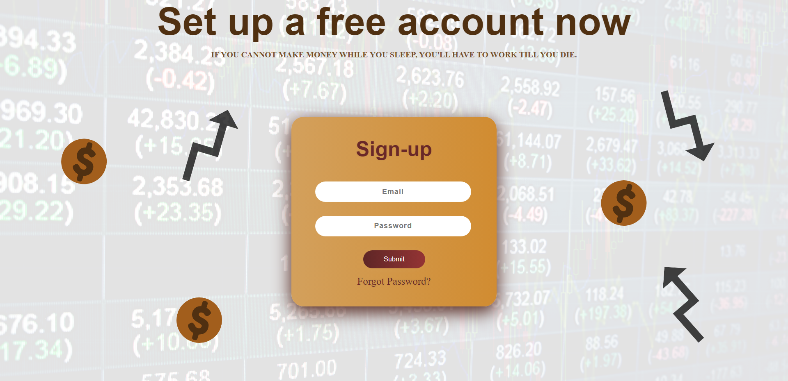
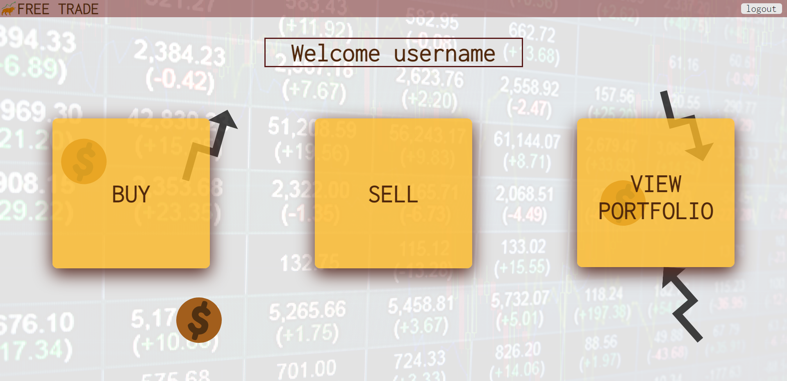
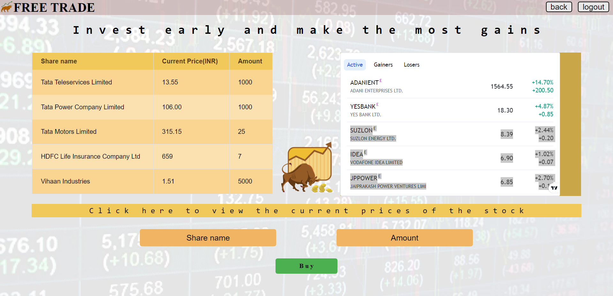
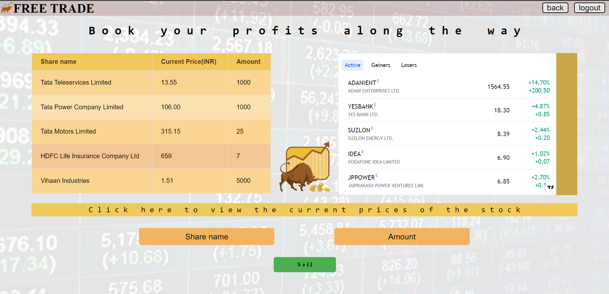
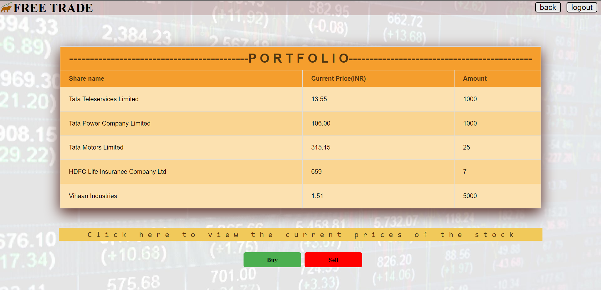

# Online Portfolio for Stock Market

Design of a simple online stock market website using **HTML** and **CSS**

Following are the snapshots of the various pages created:

## Login Page: 

## My account Page:

## Buy Page:

## Sell Page:

## My Portfolio Page:

